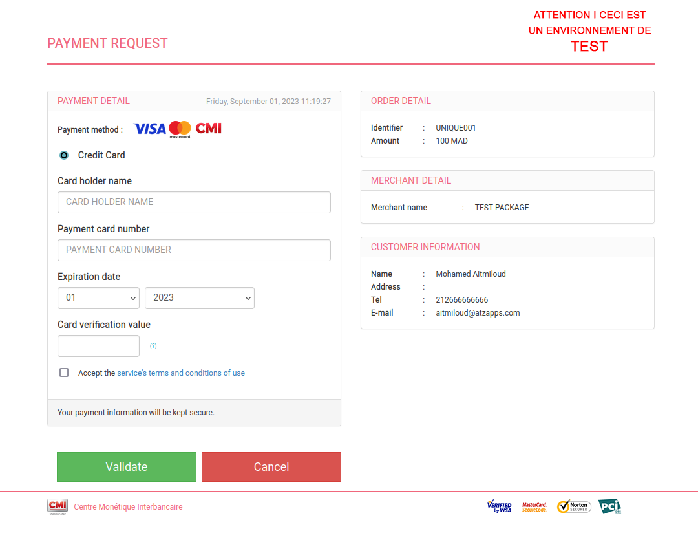

<p align="center">
 
 <h2 align="center">:package: cmi-payment-nodejs</h2>
 <p align="center">npm package to communicate with the CMI payment plateform in Morocco</p>
  <p align="center">
    <a href="https://github.com/aitmiloud/cmi-node/issues">
      
    </a>
    <a href="https://github.com/aitmiloud/cmi-node/pulls">
      
    </a>
     <a href="https://github.com/aitmiloud/cmi-node">
      
    </a>
    <a href="https://github.com/aitmiloud/cmi-node">
      
    </a>
 <a href="https://github.com/aitmiloud/cmi-node">
      
    </a>
    <br />
    <br />
  <a href="https://github.com/aitmiloud/cmi-node/issues/new/choose">Report Bug</a>
  <a href="https://github.com/aitmiloud/cmi-node/issues/new/choose">Request Feature</a>
  </p>

[](https://codecov.io/gh/aitmiloud/cmi-node)

## Installation

Install cmi-node with npm

```bash
  npm i cmi-payment-nodejs
```
    
## Usage/Examples using Express.js

```javascript
const express = require('express');
const cmi = require('cmi-payment-nodejs');

const app = express();
const port = 3000;

// Define a route to initiate a CMI payment
app.get('/pay', (req, res) => {
  // Extract necessary information from the request query parameters
  const { amount, email, tel, BillToName } = req.query;

  // Initialize the CMI payment client with your configuration
  const CmiClient = new cmi.default({
    storekey: 'YOUR_STOREKEY', // Your CMI Store Key
    clientid: 'YOUR_CLIENTID', // Your CMI Client ID
    oid: 'UNIQUE_COMMAND_ID', // A unique command ID
    shopurl: 'https://your-shop-url.com', // Your shop's URL for redirection
    okUrl: 'https://your-success-redirect-url.com', // Redirection after a successful payment
    failUrl: 'https://your-failure-redirect-url.com', // Redirection after a failed payment
    email, // email for CMI platform
    BillToName, // name as it should appear on the CMI platform
    amount, // The amount to be paid
    callbackURL: 'https://your-callback-url.com', // Callback URL for payment confirmation
    tel, // phone number for the CMI platform
  });

  // Generate an HTML form for the CMI payment
  const htmlForm = CmiClient.redirect_post();

  // Send the HTML form as the response
  res.send(htmlForm);
});

app.listen(port, () => {
  console.log(`App is listening on port ${port}`);
});

```


## 




## Basic test card numbers
Credit Card information cannot be used in test mode. instead, use any of the following test card numbers, a valid expiration date in the future, and any random CVC number, to create a successful payment.

Branch : `visa`, PAN: `4000000000000010`, Expired date: `make any date` CVC: `000`

Branch : `MasterCard`, PAN: `5453010000066100`, Expired date: `make any date` CVC: `000`

## 3D Secure test card numbers
The following card information try to tests local payments such as Strong Customer Authentication **SCA**

Branch : `MasterCard`, PAN: `5191630100004896`, Authentication code: `123` Expired date: `make any date` CVC: `000`

